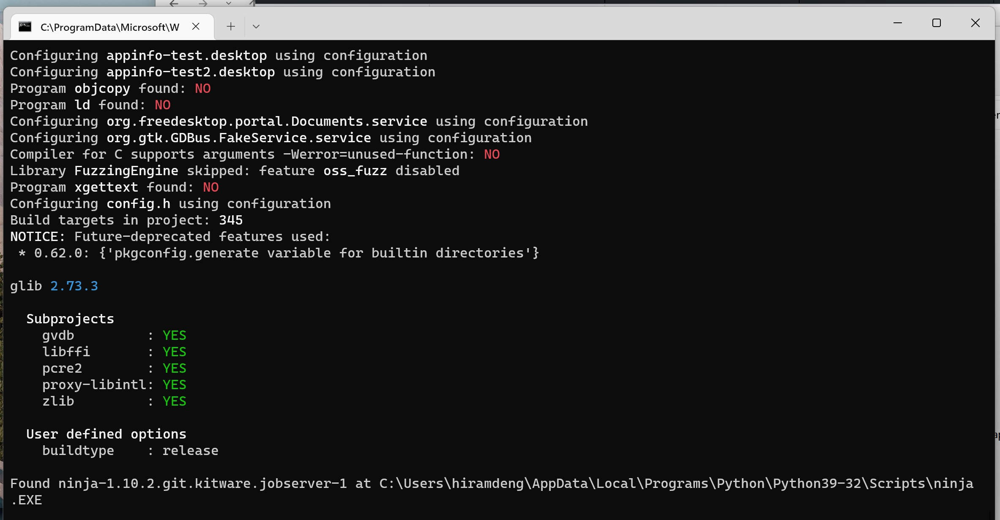
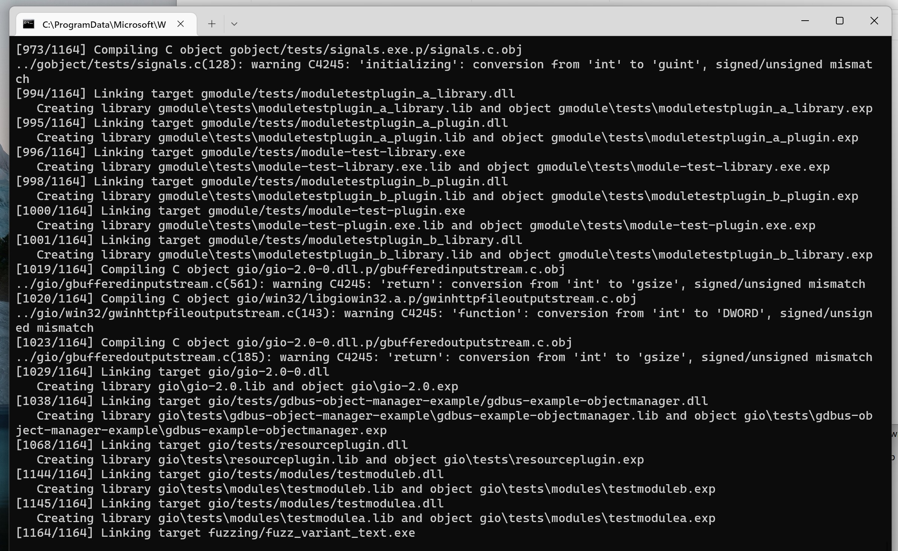
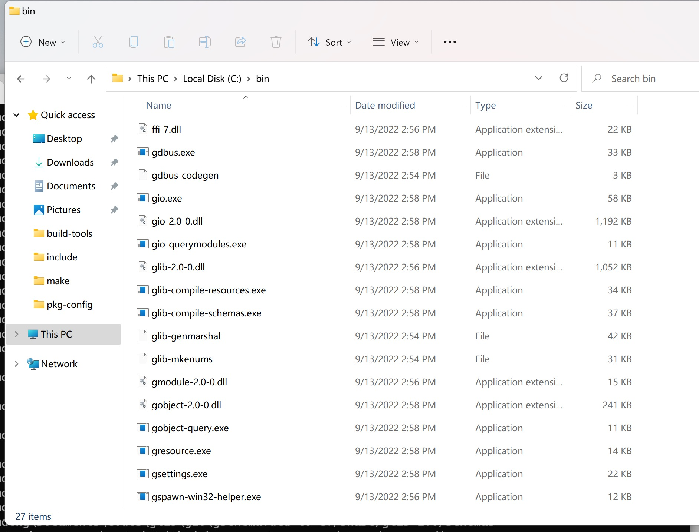
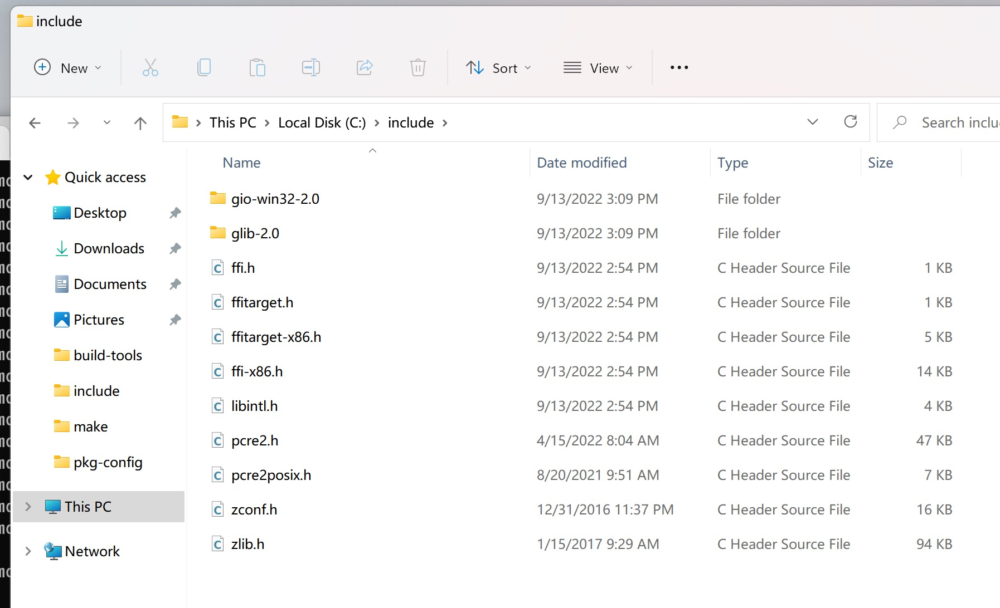
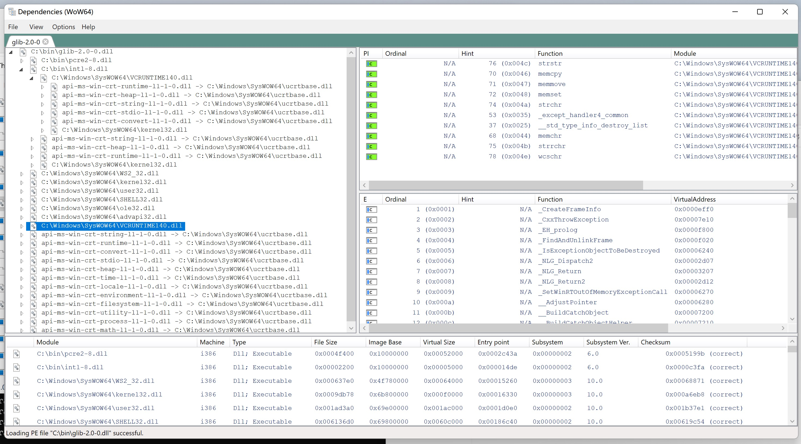
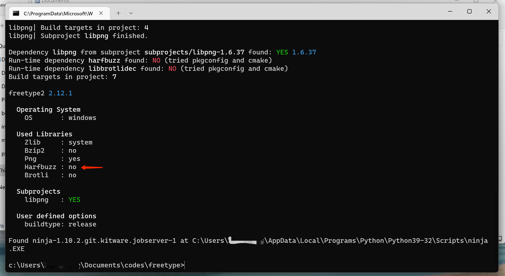
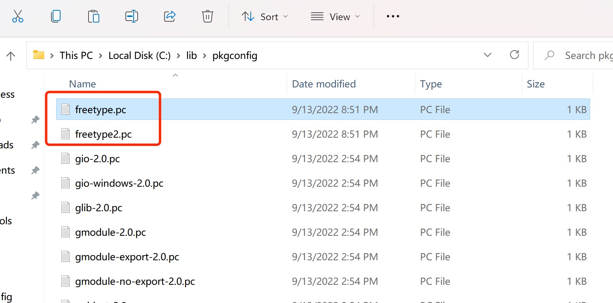
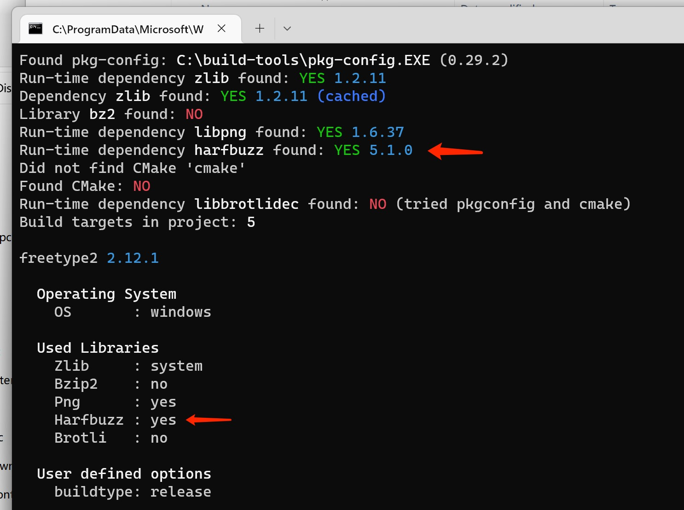
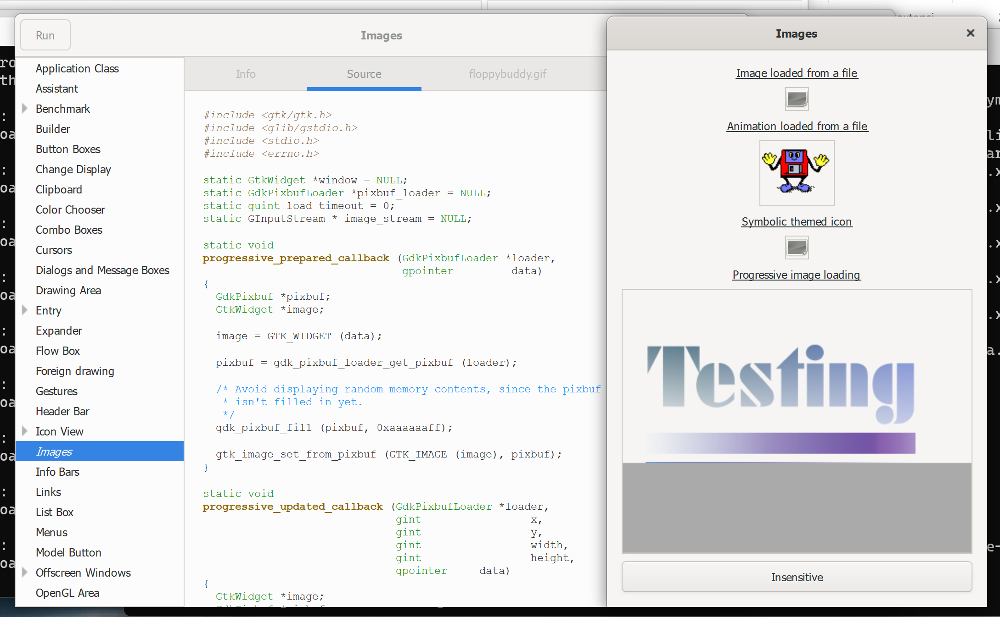

GTK3 Precompiled Libs For Native Windows
=============================

 `x86/vs16(vs2019)`

**Notice:**

The author only tested on vs2019 x86. The x64 or any other vs version may have some compile issue, or there's not, if you need the x64 version, try it yourself, bless you. 


# How to build GTK-3 for native windows(msvc), not msys2,mingw,cygwin, etc...

You could follow this guide to compile your gtk-3 libs.


## Prerequisites

* VSBuild Tools (2015, 2017, 2019, 2022) (Author only test in 2019, but all the version is simliar, good luck!)

  * https://visualstudio.microsoft.com/visual-cpp-build-tools/

* win_bison, win_flex (You can download use the link below)

  * https://sourceforge.net/projects/winflexbison/files/win_flex_bison-2.5.24.zip/download

  * ```shell
    # Extract the win flex bison tools to the build-tools folder(All the files, not only the exe file).
    # c:\build-tools\win_bison.exe
    # c:\build-tools\win_flex.exe
    # c:\build-tools\custom_build_rules
    # ...
    ```

* MSYS2 MINGW64 (This is not required, but I highly recommend installing it, so that you can easily install some gnu tools listed below, you can choose the 32/64bit version as you like, it is only used for configuring)

  * https://www.msys2.org/

* pkg-config

  * You can use mingw64 to install it 

  * ```shell
    pacman -S mingw-w64-x86_64-pkg-config
    # And then go to your msys2 install location you can find the exe there.
    # %msys2%\mingw64\bin\pkg-config.exe
    # because pkg-config deps on libwinpthread-1.dll, copy both there files to the tools foler. 
    # c:\build-tools\pkg-config.exe
    # c:\build-tools\libwinpthread-1.dll
    ```

* make

  * ```shell
    pacman -S mingw-w64-x86_64-make
    # %msys2%\mingw64\bin\mingw32-make.exe 
    # copy and rename to make.exe
    # c:\build-tools\make.exe
    ```

* xmllint

  * ```shell
    pacman -S mingw-w64-x86_64-libxml2 
    # %msys2%\mingw64\bin\xmllint.exe 
    # c:\build-tools\xmllint.exe
    # c:\build-tools\libxml2-2.dll
    # c:\build-tools\liblzma-5.dll
    # c:\build-tools\libiconv-2.dll
    # c:\build-tools\zlib1.dll
    ```

* rst2man

  * ```shell
    # rst2man is a python tools
    pacman -S mingw-w64-x86_64-python-docutils
    # %msys2%\mingw64\bin\rst2man, rst2man.py
    # c:\build-tools\rst2man
    # c:\build-tools\rst2man.py
    ```

* Python3.8+, suggest python 3.9, 3.10. You must use the same arch python (use 32bit python to build x86).

  * Notes: when you have multiple python envs, you must be careful in checking the configuration is in the correct environments.

* Python meson, ninja, docutils

  * ```shell
    pip install meson, ninja, docutils
    ```

* Setup the system environment variables

  * In command prompt.

    ```powershell
    set PKG_CONFIG_PATH=c:\lib\pkg-config
    set LIB=%LIB%;c:\lib
    set INCLUDE=%INCLUDE%;c:\include
    set PATH=c:\bin;c:\build-tools;%PATH%
    ```

  * Or you can set it up in the desktop environment.

  * 

  * **Notice:** 

  * Why I should set up those folders even though there is nothing in them? 

  * Because `c:\include`, `c:\lib` `c:\bin` are used for storing the target SDK libs and binary files. And in the building process, they will referenc some libs and binary which were built from the pre-steps. If we haven't set up those environment variables, the building process will fail.

* git, used for checkout the codes.


Now, it's all ready. Let's go and build it!


## Building

**Notice:** 

* **YOU MUST BUILD THE CODE FOLLOWING THESE STEPS.**

* Because almost every lib has its dependencies, and some of them are the same. If you don't follow these steps, some libs will be built multiple times with different versions. It will cause the weird compile issue or runtime issue.

* **meson setup must add --buildtype=release argument.** Otherwise, it will cause runtimes errors. As in some projects, the build configuration does not match in debug mode, the compiler will use the /MD to compile all the c/cpp files, no matter what build type you set.

* If you want to config to other directory, you can append the prefix argument. For example:

  `meson setup --buildtype=release --prefix=d:\buildsdk _build`


**1. GLib-2.0:**  - 2.73.3

```shell
git clone https://gitlab.gnome.org/GNOME/glib.git
git checkout <version>
meson setup --buildtype=release _build
meson compile -C _build
meson install -C _build
```

(1) Setup finish.



(2) Compile finish.



(3) Install finish. You can see the libs and binary files will install in those directories.

 

And you can use dependencies walker to check the dll is linked to the right runtime libs.




**2. freetype2:** - 2.12.1

```shell
git clone https://gitlab.freedesktop.org/freetype/freetype.git
git checkout <version>
meson setup --buildtype=release _build
```



After setup is complete. Notice, that the FreeType libs are built without harfbuzz. This will be fixed later. Go ahead compile and install. 

```shell
meson compile -C _build
meson install -C _build
```

**Notice:** 

After install. You will see freetype2.pc in the lib\pkgconfig directory. Copy and rename to freetype.pc , left those two pkg-config files so that other libs can match the correct version of the freetype library.




**3. fontconfig:** - 2.14.0

```shell
git clone https://github.com/freedesktop/fontconfig.git
git checkout <version>
meson setup --buildtype=release _build
meson compile -C _build
meson install -C _build
```


**4. cairo:** - 1.17.6

```shell
git clone https://gitlab.freedesktop.org/cairo/cairo.git
git checkout <version>
meson setup --buildtype=release _build
meson compile -C _build
meson install -C _build
```


**5. gobject-introspection:** - 1.73.1

```shell
git clone https://github.com/GNOME/gobject-introspection.git
git checkout <version>
meson setup --buildtype=release -Dcairo_libname=cairo-gobject-2.dll _build
meson compile -C _build
meson install -C _build
```


**6. harfbuzz:** - 5.1.0

```shell
git clone https://github.com/harfbuzz/harfbuzz.git
git checkout <version>
meson setup --buildtype=release _build
meson compile -C _build
meson install -C _build
```


**7. freetype again:**

```shell
meson setup --wipe --buildtype=release _build
meson compile -C _build
meson install -C _build
```

This time, you will see the HarfBuzz enabled.




**8. fribidi:** - 1.0.12

```shell
git clone https://github.com/fribidi/fribidi.git
git checkout <version>
meson setup --buildtype=release -Ddocs=false _build
meson compile -C _build
meson install -C _build
```


**9. pango:** - 1.50.9

```shell
git clone https://gitlab.gnome.org/GNOME/pango.git
git checkout <version>
meson setup --buildtype=release _build
meson compile -C _build
meson install -C _build
```


**10. gdk-pixbuf-2.0:** - 2.42.9

```shell
git clone https://gitlab.gnome.org/GNOME/gdk-pixbuf.git
git checkout <version>
meson setup --buildtype=release _build
meson compile -C _build
meson install -C _build
```


**11. atk:** - 2.38.0

```shell
git clone https://github.com/GNOME/atk.git
git checkout <version>
meson setup --buildtype=release _build
meson compile -C _build
meson install -C _build
```


**12. gtk-3:** 3.24.34

```shell
git clone https://gitlab.gnome.org/GNOME/gtk.git
git checkout <version>
meson setup --buildtype=release _build
meson compile -C _build
meson install -C _build
```


**Congratulation! You did it!**

Open `c:\bin\gtk3-demo.exe` , check it can run or not.

